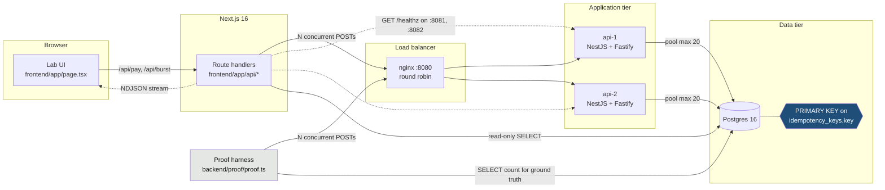
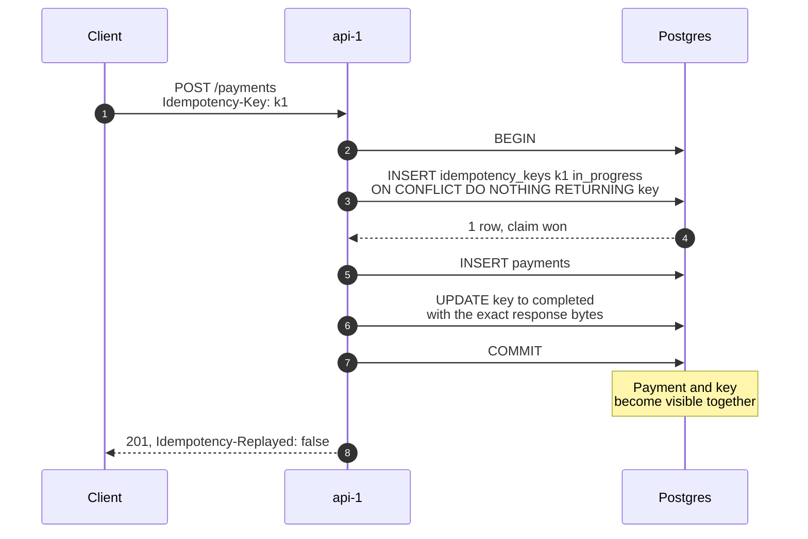
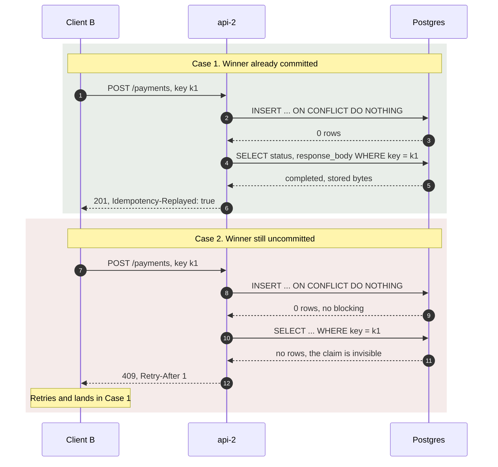
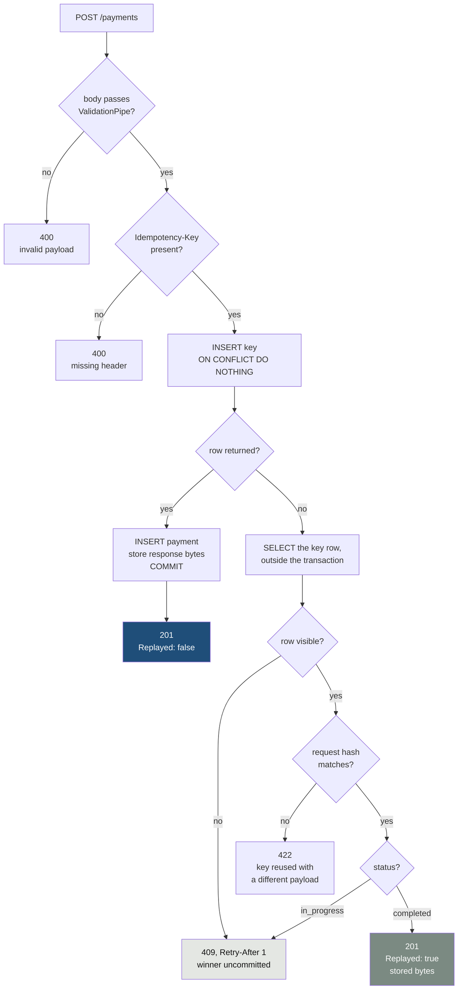
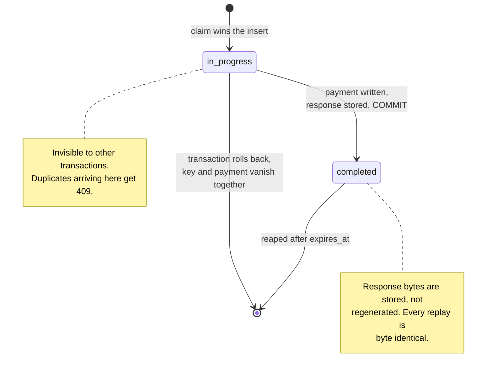
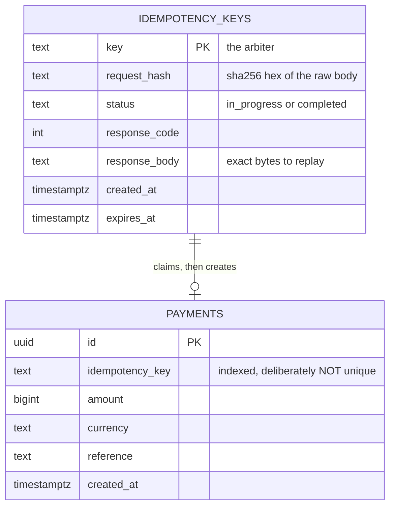
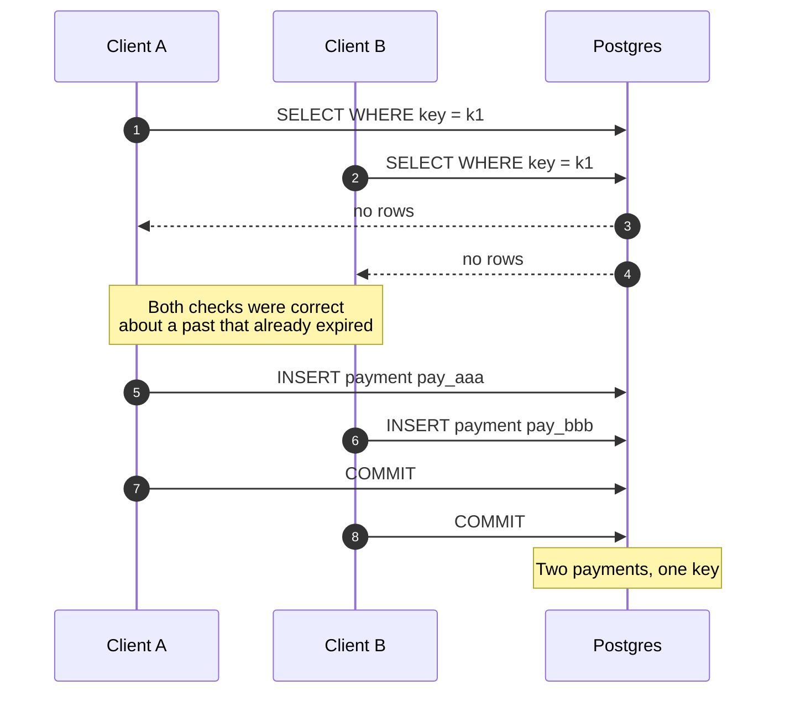

# Retry-safe payments endpoint: NestJS + TypeScript

One write endpoint that is safe to call twice. `POST /payments` with an
`Idempotency-Key` header returns the same payment for the same key, forever,
no matter how many callers arrive at once or which instance they land on.

## Architecture

Two identical API instances sit behind nginx and share one Postgres. Nothing
is shared between the processes except the database index, which is the whole
point: if a single process were serving every request, a reviewer could
reasonably ask whether some in-process lock was doing the work.



The blue box is the only thing arbitrating anything. Both API processes are
stateless and interchangeable.

## The mechanism

`idempotency_keys.key` is a PRIMARY KEY. The service does not ask whether the
key exists. It inserts, and reads the conflict as its answer:

```ts
const claimed = await tx
  .insert(idempotencyKeys)
  .values({ key, requestHash: hash, status: "in_progress" })
  .onConflictDoNothing({ target: idempotencyKeys.key })
  .returning({ key: idempotencyKeys.key });
```

Zero rows back means someone else owns the key. One row back means you won and
may write the payment. **The claim and the payment insert commit in the same
transaction**, so there is never a key without its payment or a payment
without its key.

`onConflictDoNothing` is load-bearing. Unlike `DO UPDATE`, it does not block on
a conflicting uncommitted row; it returns immediately. At 500 concurrent that
is the difference between 499 losers releasing their connection in microseconds
and 499 losers queueing behind the winner until the pool is exhausted.

### The winner

One transaction covers the claim and the write, so both become visible in the
same instant.



### The losers

Two distinct loser paths, depending on whether the winner has committed yet.
The second one is the branch most implementations get wrong.



## Response contract

| Situation | Status | Headers |
|---|---|---|
| First call | `201` | `Idempotency-Replayed: false` |
| Repeat after the winner committed | `201` | `Idempotency-Replayed: true` |
| Repeat while the winner is still in flight | `409` | `Retry-After: 1` |
| Same key, different body | `422` | none |
| No `Idempotency-Key` header | `400` | none |
| Body fails validation | `400` | none |

The `409` is the branch most implementations get wrong. When a duplicate
arrives before the winner commits, the key row is claimed but invisible, so
there is no stored response to replay. Returning `200` with an empty body there
is a data-loss bug wearing a success code.

Every branch above, in one picture. Validation runs before the handler body,
because NestJS applies pipes while resolving parameters, so a malformed body
is rejected before the missing-header check is ever reached.



## Key lifecycle



There is no failed state. A crash mid-write rolls back the claim along with
the payment, which frees the key rather than poisoning it.

## Schema



`response_body` is `text`, not `jsonb`. Postgres normalises jsonb, so key order
and whitespace are not preserved, and a replay would return different bytes
than the original response for an equal value. Idempotency is a promise about
bytes.

`payments.idempotency_key` is left unconstrained on purpose. If both tables
enforced uniqueness, the proof could not tell which mechanism stopped the
duplicate.

## Layout

```
backend/
├── src/
│   ├── main.ts                    Fastify adapter, rawBody, validation, shutdown hooks
│   ├── app.module.ts
│   ├── db/
│   │   ├── schema.ts              Drizzle tables, where the PRIMARY KEY lives
│   │   └── db.module.ts           pool, boot-time migration, graceful close
│   ├── payments/
│   │   ├── payments.service.ts    the claim. read this one.
│   │   ├── payments.controller.ts HTTP mapping only, no logic
│   │   ├── idempotency.types.ts   Outcome union
│   │   └── dto/create-payment.dto.ts
│   └── health/health.controller.ts
├── proof/proof.ts                 500 concurrent callers, one key, DB assertions
└── migrations/0001_schema.sql
frontend/                         Next.js lab; AGENT.md is its integration spec
docs/DIAGRAMS.md                  every diagram, including deployment
```

`payments.service.ts` is the only interesting file. Everything else is
transport, wiring, or measurement.

## Running it

```bash
cd backend && npm install
make up          # postgres + two API instances + nginx on :8080
make proof       # 500 concurrent requests, one key
make lab         # the interactive lab on :3000
```

`make up`, `make down`, `make proof`, and `make lab` run from the repo root.
The `Makefile` and `docker-compose.yml` there orchestrate `backend/` and
`frontend/`.

Expected:

```
payment rows created  1
HTTP 201 created      1
HTTP replays          499
distinct bodies       1
served by             api-1=251  api-2=249

[PASS] exactly one payment row       1
[PASS] exactly one 201 created       1
[PASS] all others replayed           499
[PASS] one distinct response body    1
[PASS] no errors                     0
[PASS] no unresolved conflicts       0
```

## The naive version

```bash
git checkout v0-naive
make down && make up && make proof
```

`v0-naive` drops the primary key and does the obvious thing: `SELECT` the key,
insert if missing. It passes every sequential test and produces something like
17 payment rows under concurrency.



Under `READ COMMITTED`, each transaction's `SELECT` sees a snapshot taken when
that statement began. Every request that checks before any of them commits
sees an empty table, and every one of them inserts. The check is not wrong
about the past; it is answering a question whose answer expires before it can
be acted on.

`make down` between tags is not optional. The schemas differ and
`IF NOT EXISTS` will leave the old table in place, so you would be testing new
code against old constraints.

The whole fix:

```bash
git diff v0-naive v1-idempotent -- backend/migrations backend/src
```

## The lab

`frontend/` is a Next.js 16 teaching lab. Left pane is what a customer could
know; right pane is every request that was really sent and the rows really in
Postgres. Five scenarios: a normal payment, a lost response, a triple click, an
instance dying mid-checkout, and the 500-caller burst.

It speaks HTTP to `:8080` for payments, polls `:8081` and `:8082` for
instance health, and reads the two tables through a read-only connection. The
backend language is invisible to it, which is a reasonable argument that the
API contract is the real interface.

```bash
make up
make lab         # http://localhost:3000
```

For scenario 4, run `docker compose stop api-1` yourself, then
`docker compose start api-1`. There is deliberately no button for it.
[`frontend/AGENT.md`](frontend/AGENT.md) has the full contract, invariants,
and a verification checklist.

The fan-out runs server-side in a route handler. Chrome opens about six
connections per host, so a browser-side burst would serialise itself and pass
even against `v0-naive`.

## Housekeeping

Rows are stamped with `expires_at` (24h). Reap them or the table grows forever:

```sql
DELETE FROM idempotency_keys WHERE expires_at < now();
```

Reap only `completed` rows. An `in_progress` row cannot survive a crash.
Because the claim and the write share a transaction, the rollback takes it
with the payment. If you ever see a stale one, the transaction boundary has
been broken somewhere.

## Known edges

- **Request hashing** is `sha256` over the raw bytes, so a client sending
  semantically identical but differently formatted JSON gets a `422`.
  Canonicalise first if your clients are not byte-stable.
- **Key reuse cannot be detected during the in-flight window.** The winner's
  row is invisible, so a mismatched payload gets `409`, then `422` on retry.
- **Keys are global.** Before this goes near real money, scope them per API
  client, or two customers can collide.
- **No read replica.** A standby serving replays can miss a commit that
  already landed on the primary and return `404` for a payment that exists. If
  you add one, capture `pg_current_wal_insert_lsn()` on commit and have the
  replica path wait on `pg_last_wal_replay_lsn()`.

## More diagrams

[`docs/DIAGRAMS.md`](docs/DIAGRAMS.md) has the full set, including the
deployment topology, the console's streaming data flow, and the repository
history.
