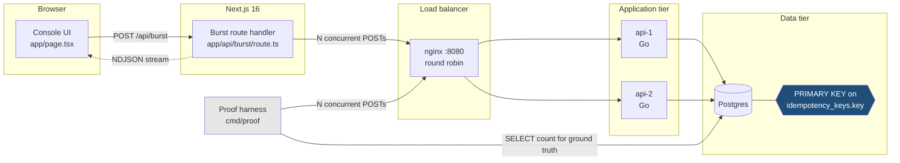
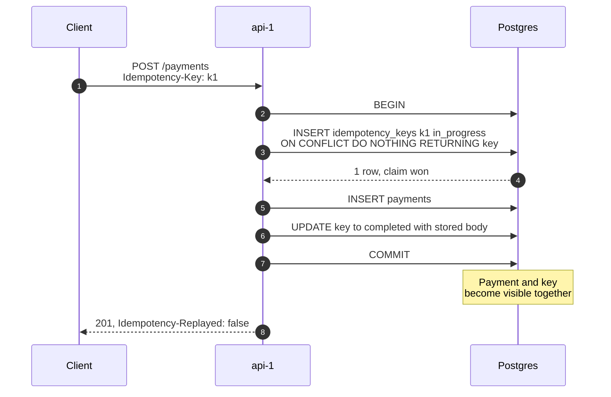
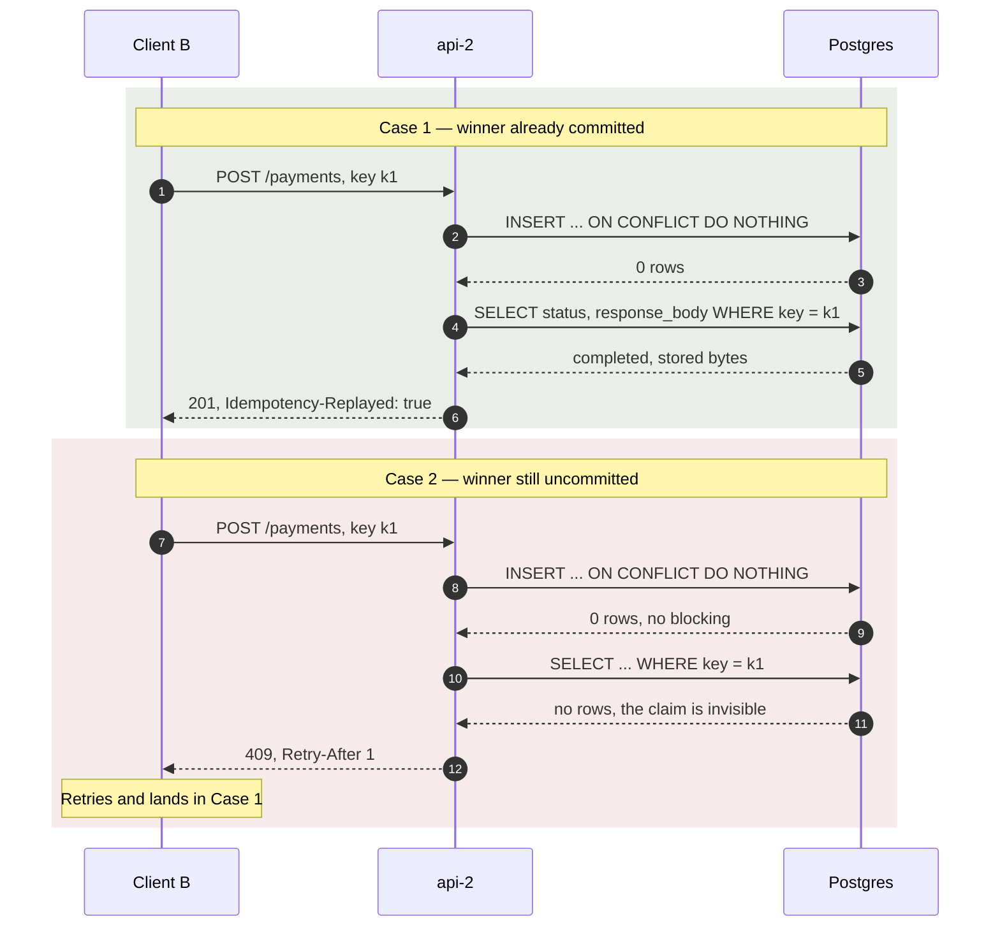
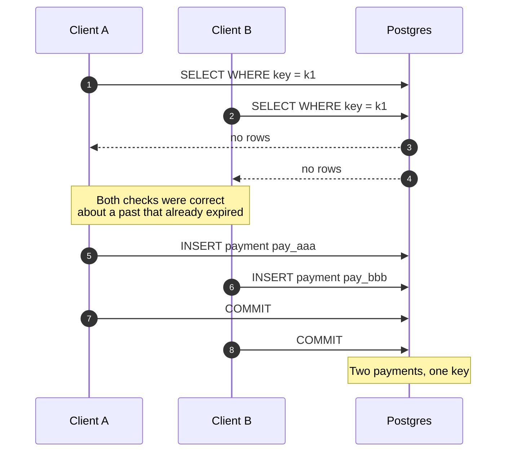
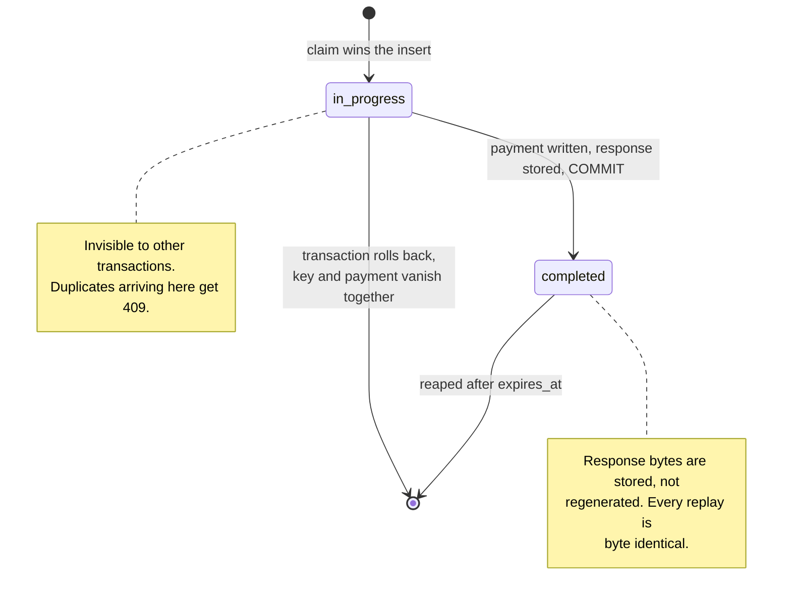
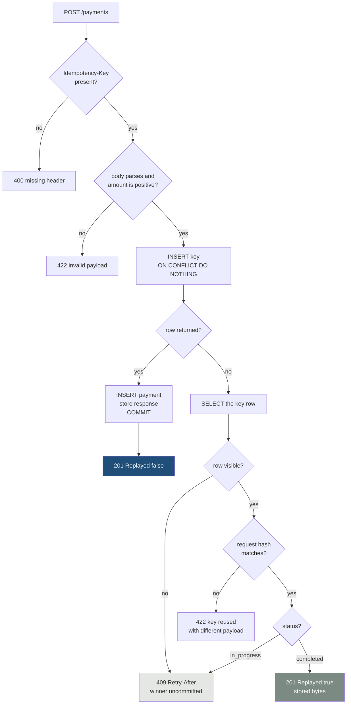
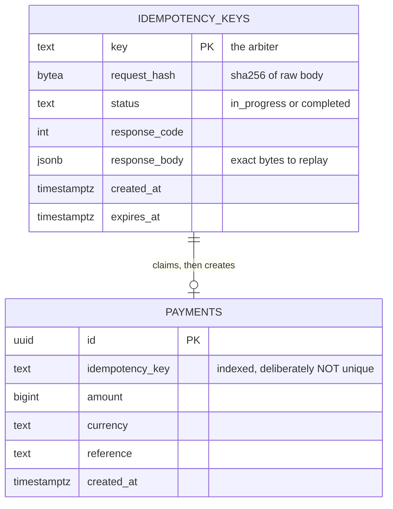
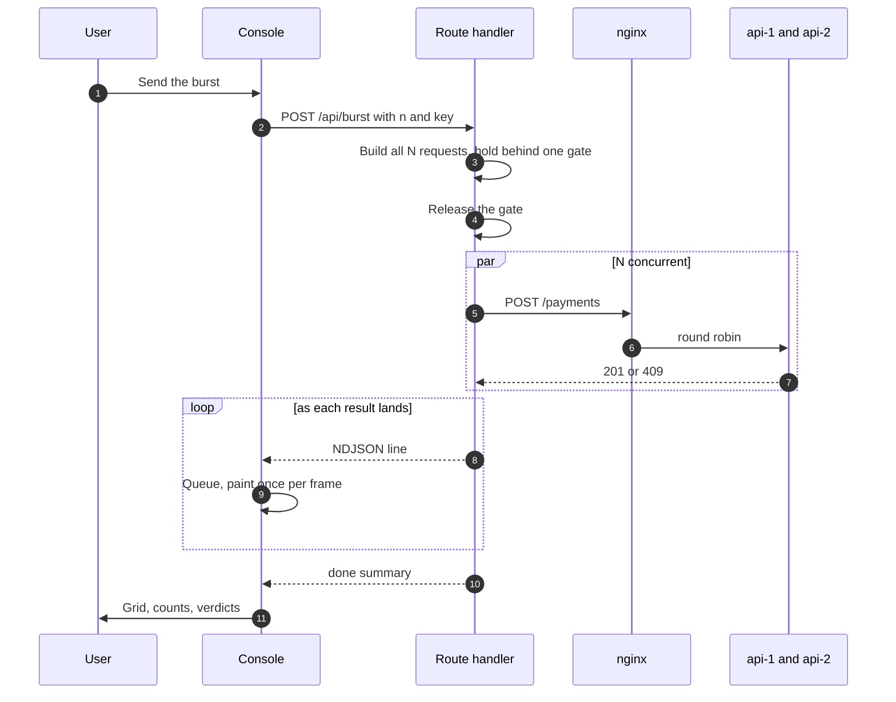
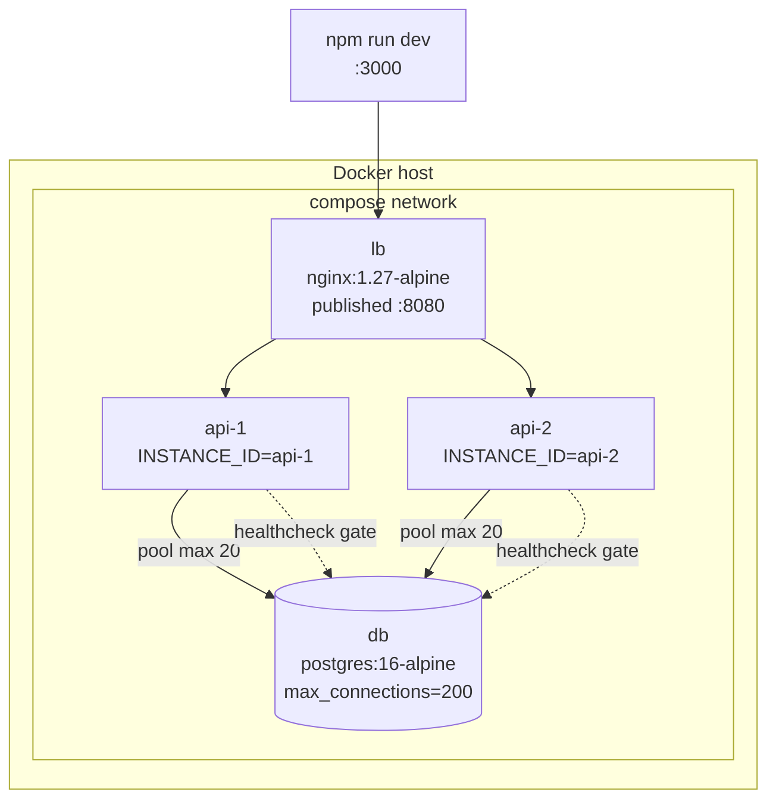
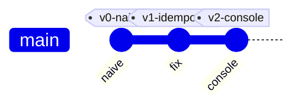

# Diagrams

Every diagram below is Mermaid and renders directly on GitHub, GitLab, Notion,
and Obsidian. No image files to keep in sync with the code.

---

## 1. System architecture

Where each process lives and what it is allowed to talk to. The console never
reaches the Go API directly; the harness is the only thing with a database
connection besides the API itself.



The blue box is the only thing arbitrating anything. Both API processes are
stateless and interchangeable; that is the point of running two.

---

## 2. Request lifecycle, the winner

One transaction covers the claim and the write, so both become visible in the
same instant.



---

## 3. Request lifecycle, the losers

Two distinct loser paths depending on whether the winner has committed yet.
The second one is the branch most implementations get wrong.



`ON CONFLICT DO NOTHING` returning immediately instead of blocking is what
keeps 499 losers from holding connections until the winner commits.

---

## 4. The naive race

Same picture, minus the index. Every transaction reads an empty table and every
one of them writes.



---

## 5. Idempotency key state machine



There is no failed state. A crash mid-write rolls back the claim along with the
payment, which frees the key rather than poisoning it.

---

## 6. Handler decision tree



---

## 7. Schema



`payments.idempotency_key` is left unconstrained on purpose. If both tables
enforced uniqueness, the proof could not tell which mechanism stopped the
duplicate.

---

## 8. Console data flow



Requests are constructed before any are released. Building them inside the loop
would stagger the start by however long construction takes, which is the same
order of magnitude as the window being tested.

---

## 9. Deployment



Pool size is deliberately far below the burst size. Losers must release their
connection immediately, or the experiment measures queueing instead of
correctness.

---

## 10. Repository history



The diff worth reading:

```bash
git diff v0-naive v1-idempotent -- migrations internal/store
```

Three files, and only one idea: stop asking the database a question whose
answer expires before you can act on it.
